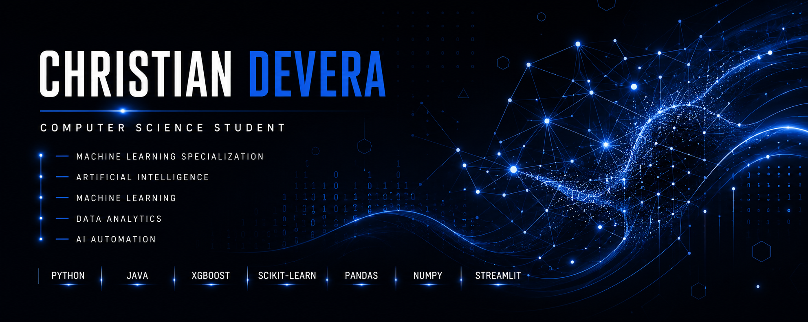
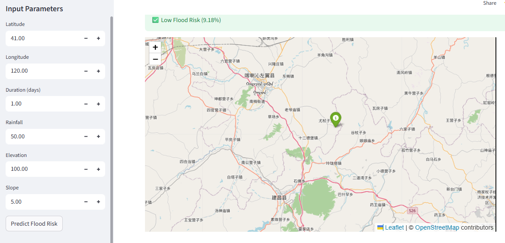
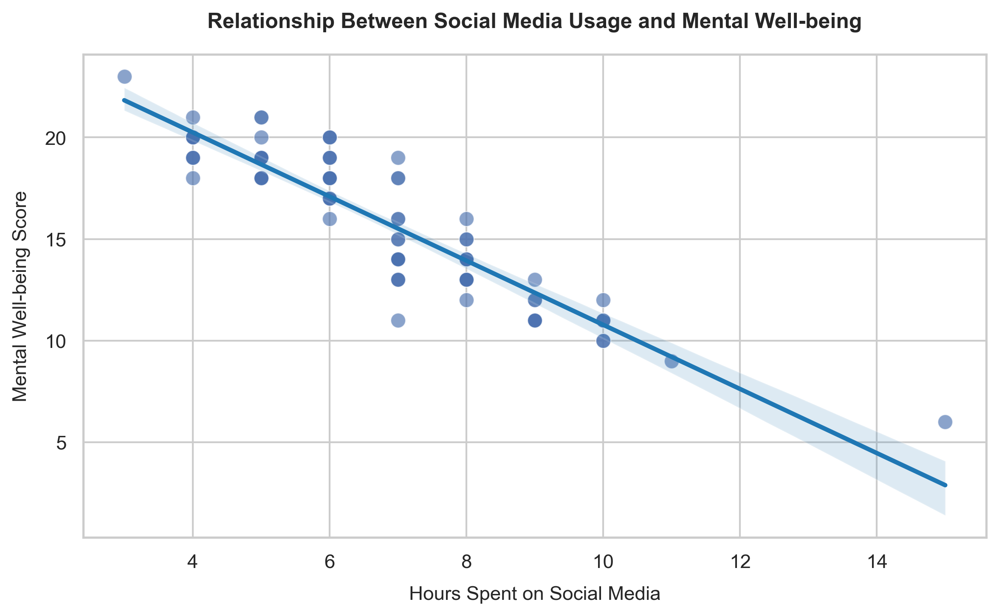
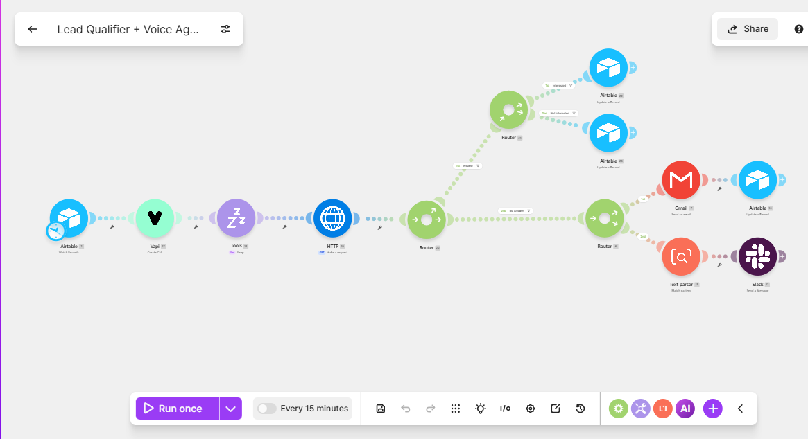
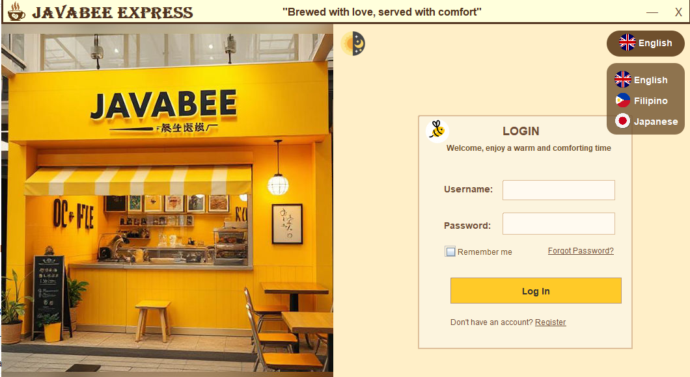
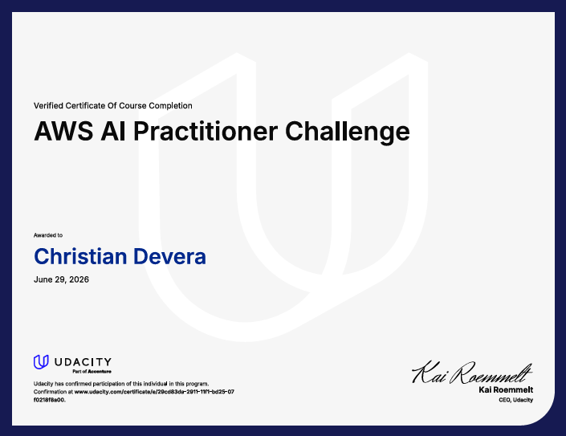
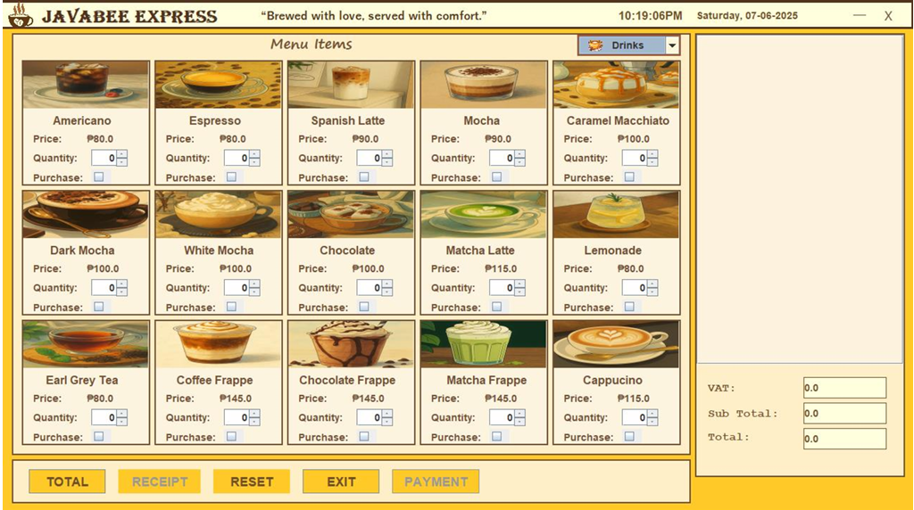
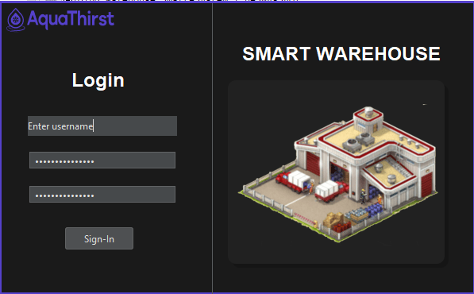
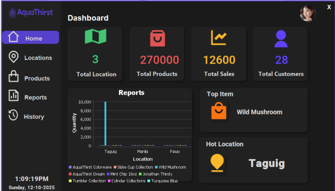

# 👋 Hi, I'm Christian Devera

### Artificial Intelligence • Machine Learning • Data Analytics • AI Automation

---

# 🚀 About Me

I'm a **Computer Science student specializing in Machine Learning** who enjoys building intelligent software, AI-powered applications, automation workflows, and data-driven solutions.

My goal is to create software that solves real-world problems through Artificial Intelligence and modern software engineering.

### Current Interests

🧠 Artificial Intelligence

🤖 Machine Learning

📊 Data Analytics

⚡ AI Automation

☁ Cloud Deployment

🌐 Full Stack Development

---

# 🤖 AI Automation Toolkit

<table>

<tr>

<td>

### AI Models

- OpenAI GPT
- Google Gemini
- Claude AI
- GitHub Copilot

</td>

<td>

### Automation

- n8n
- Make.com
- MCP
- REST APIs
- AI Agents

</td>

</tr>

<tr>

<td>

### Development

- VS Code AI
- Prompt Engineering
- GitHub
- Vercel

</td>

<td>

### Data & ML

- Pandas
- NumPy
- Scikit-Learn
- XGBoost
- Matplotlib
- Seaborn

</td>

</tr>

</table>

---

# 💻 Tech Stack

### Languages

### Frameworks & Tools

### Currently Learning

---

# 🚀 Featured Projects

<table>

<tr>

<td width="50%">

### 🌊 Geospatial Flood Risk Predictor

Machine Learning application that predicts flood risk using geospatial and environmental data.

**Tech**

Python

XGBoost

Folium

Streamlit

<a href="https://github.com/Tiaaan12/geospatial-flood-risk-prediction.git">

View Repository →

</a>

</td>

<td width="50%">

### 📊 Student Well-being Analytics

Comprehensive statistical analysis exploring social media usage and student well-being.

**Tech**

Python

SciPy

Pandas

Seaborn

<a href="https://github.com/Tiaaan12/Correlation-research.git">

View Repository →

</a>

</td>

</tr>

<tr>

<td width="50%">

### 🤖 AI Workflow Automation

Automation workflows powered by AI to simplify repetitive tasks and improve productivity.

**Tech**

OpenAI

Python

Automation

API Integration

<a href="YOUR_REPOSITORY">

View Repository →

</a>

</td>

<td width="50%">

### ☕ Java Cafe Management System

Desktop application demonstrating Object-Oriented Programming with Java Swing.

**Tech**

Java

Swing

OOP

GUI

<a href="https://github.com/Tiaaan12/Cafe-Management.git">

View Repository →

</a>

</td>

</tr>

</table>

---

# 📈 GitHub Analytics

---

---

# 🏆 Certifications

### Highlights

✔ Machine Learning

✔ Data Analytics

✔ Python Programming

✔ SQL

✔ Artificial Intelligence

✔ Java Development

---

# 🎯 Current Goals

✅ Build production-ready AI applications

✅ Learn AI Agents & RAG

✅ Contribute to Open Source

✅ Explore MLOps

✅ Improve Full Stack Development

✅ Secure an AI / ML Internship

---

# 📸 Project Gallery

<table>

<tr>

<td>

</td>

<td>

</td>

</tr>

<tr>

<td>

</td>

<td>

</td>

</tr>

</table>

---

# 🌐 Connect With Me

---

## 💭 Philosophy

> *"Artificial Intelligence isn't about replacing people—it's about empowering them to solve bigger problems."*

⭐ Thanks for visiting my profile!

